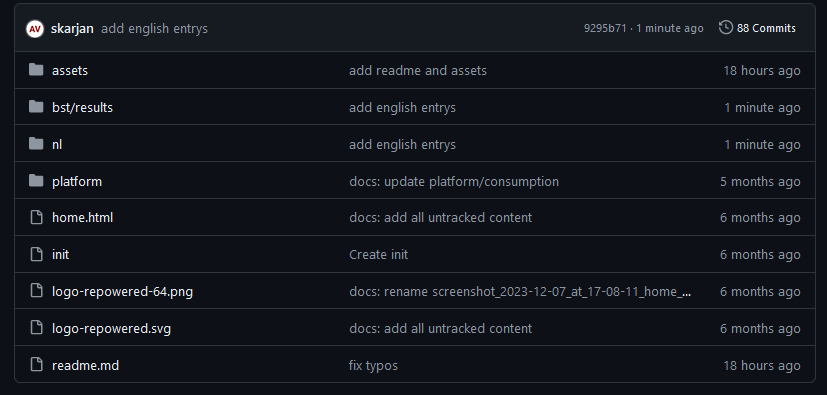

# Repowered Wiki
These are the pages built to explain terms and concepts used in the Repowered applications.

### Setup
- Create a [GitHub.com account](https://www.github.com/)  
- Ask for access to the [repository](https://github.com/repowerednl/wiki) (contact me (a.vanderveen@repowered.nl) or anyone else from the data team) 
- Download GitHub Desktop for [Windows](https://central.github.com/deployments/desktop/desktop/latest/win32) or [Mac](https://central.github.com/deployments/desktop/desktop/latest/darwin) 
- Install it 
- After launching the application choose **Sign in to GitHub.com** 

- Choose **continue** 
- If you agree with the permissions choose **Authorize desktop** 
- Use the 2FA method you chose when registering the account. 
- Allow GitHub Desktop to open links from Github 
- Configure Git by checking/adding your credential 
- In the application you can choose **Clone a repository from the internet** 
- Select/search  repoweredn/wiki and then **Clone** 

You are now ready to start contributing to the Wiki!

### Contributing 
### ATTENTION: Before making changes, **ALWAYS** pull first. You can do this in GitHub Desktop by clicking **Fetch Origin** 
  
### This makes sure that if someone made changes after your last change, they are incorporated into your local version.

- With GitHub Desktop open ande the Wiki repository selected, choose **Show in Explorer**
You will see some folders.
- Open the **nl** folder. */bst* and likewise for the */platform.*
- For example, lets edit the *annual-savings.md* entry.
- Go to *bst/results/* 
- Then right click *annual-savings.md* and choose **edit with notepad/bewerken met kladblok**
- Every entry starts with meta data encapsulated between 3 dashes *--- META ---*
- This can be ignored. Below the second *---* is where the entry starts.
- Use the syntax for [markdown](https://www.markdownguide.org/basic-syntax/)
- Make the changes and then save the file. 
- Open **Github Desktop**, you should see the changed file and its changes
- If everything is correct, choose **Commit to Main**
- After that choose: **Push Origin** 

Now the changes have been made. If the tooltip is currently in use by an application the change should be visible almost immediately
