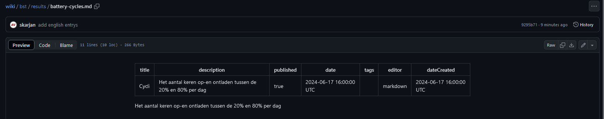
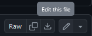
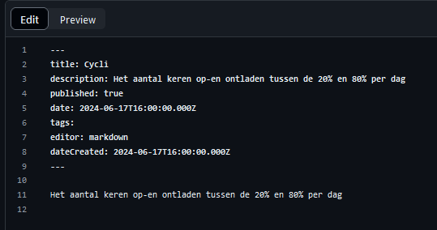
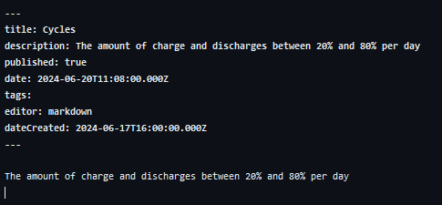
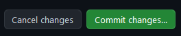
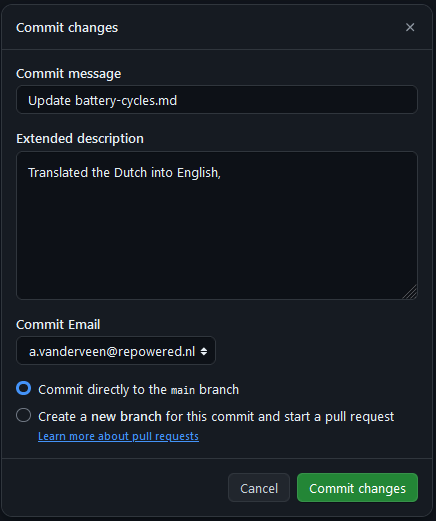
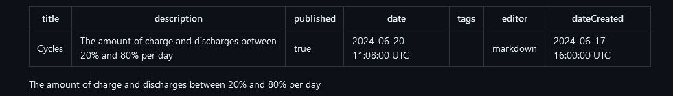

# Repowered Wiki
These are the pages built to explain terms and concepts used in the Repowered applications.

### Setup
- Create a [GitHub.com account](https://www.github.com/)  
- Ask for access to the [repository](https://github.com/repowerednl/wiki) (contact me (a.vanderveen@repowered.nl) or anyone else from the data team) 
- Open the [repository](https://github.com/repowerednl/wiki)
- In the repository you will see folders and files:

We currently have 2 applications using this Wiki. 
The [platform](https://mijn.repowered.nl) and the [bst](https://bst.repowered.nl)

To edit the English entries you go directly into either */platform* or */bst*. In this example we will edit edit an English entry from the */bst* wiki.

Go to */bst/results/* and then open **battery-cycles.md** 

You can see this entry is in Dutch. We are going to change it to English. Choose **edit** (pencil icon) in the top right side of the screen: 

After clicking the screen will turn into a texteditor:

There are two parts here worth noting. Between the dashes is what we call the meta data: 

`---` 
`title: Cycli`  
`description: Het aantal keren op-en ontladen tussen de 20% en 80% per dag`  
`published: true`  
`date: 2024-06-17T16:00:00.000Z`  
`tags: `  
`editor: markdown`  
`dateCreated: 2024-06-17T16:00:00.000Z`  
`---` 

If needed change the title and description.

**Always set the date after editing!**

Below the second *---* is where the entry begins:

`Het aantal keren op-en ontladen tussen de 20% en 80% per dag`

After making the changes this is what we have:

If we are happy with the result we can choose **Commit changes** in the top right side:

In the next window add a description of what changes have been made. Make sure the **Commit Email** is correct and the selected option is **Commit directly to the main branch**.
Then choose **Commit Changes**:

You will be taken back the visual representation of the entry:

You are now ready to start contributing to the Wiki!

